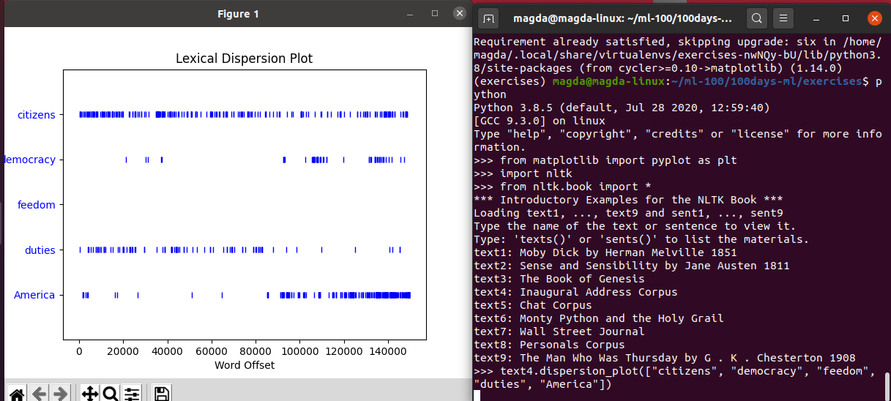

## 100DaysOfCode with Machine Learning 

#### Start: November 23, 2020

##### My Goals:
* don't be hard on myself
* code/learn everyday a bit
* focus mostly on Natural Language Processing 

### Day 3: November 26 , 2020

**Plans for Today:**
* finish chapter 1

**Today's Progress:**
* finished chapter 1 with exercises

Notes:
* A **collocation** is a sequence of words that occur together unusually often. 

```
list(bigrams(["more", "is", "said", "than", "done"])) // checks pairs of words 
.collocations() // frequent bigrams

fdist.max()
fdist.freq('monstrous') // frequency of a given sample
fdist.N() // total number of samples
fdist1 |= fdist2 // update fdist1 with counts from fdist2
```

**Thoughts:**
Coding is the easier part of the NLP. That's true, that thinking about the problem should go first. 

**Link to work:**

**Plans for tomorrow:**
* at least one video on Coursera

**Resources:**


### Day 2: November 24, 2020

**Plans for Today:**
* continue the first chapter of NLP book
or/and
* at least one video on Coursera

**Today's Progress:**
* read to part 3.3 NLP with Python Chapter 1 - started learning about Frequency Distributions

```
// FreqDist - built-in support 
fdist1 = FreqDist(text1) 
fdist1.most_common(50) // finds 50 the most common worlds 
fdist1["whale"] // finds how many times the word is in the text

fdist1.plot(50, cumulative=True) // chart to show the frequency of the most common words

fdist1.hapaxes() // finds the rare words

// how to find words that are more than 15 characters long 
[w for w in V if len(w) > 15]

// find words that are more than 7 characters long and they are repeated in text more than 7 times
fdist5 = FreqDist(text5)
sorted(w for w in set(text5) if len(w) > 7 and fdist5[w] > 7)
```


**Thoughts:**
* Today I've been a bit tired. I skimmed through the Python lists, slicing and strings. 

**Link to work:**

**Plans for tomorrow:**
* continue chapter 1

**Resources:**
https://www.nltk.org/book/ch01.html#:~:text=Once%20you've%20installed%20NLTK,collection%20as%20shown%20in%201.1.&text=Figure%201.1%3A%20Downloading%20the%20NLTK,the%20available%20packages%20using%20nltk


### Day 1: November 23, 2020

**Plans for Today:**
* check a few links & choose the most interesting

**Today's Progress:**
* started Applied Text Mining in Python course on Coursera & watched about half or the first week
* refreshed String Operations and Handling Larger Text in Python.

```
[ ] .istitle()
[ ] .endswith(char)  .startswidth(char)
[ ] .isupper()  .islower()  .istitle()
[ ] .isalpha()  .isdigit()  .isalnum() 
[ ] .lower() .upper(); .titlecase()
[ ] .split(ch)
[ ] .join(ch)
[ ] .strip() .rstrip()
[ ] .find(ch) .rfind(ch)
[ ] .replace(u, v)
[ ] list(word) // to split characters in a word

// work with files
[ ] f = open('title.txt', 'r')
[ ] f.readline() // 1st line
[ ] f.seek(0) // reset the reading to start from the beginning
[ ] text = f.read()  // all text
[ ] text.splitlines()
[ ] f.write(message)
[ ] f.close()

// regular expressions
'@[A-Za-z0-9_]+' // will return all words that:
// - start with '@' and are followed for at least one:
// capital letter
// lowercase letter
// uppercase letter
// number
// or underscore

import re
[w for w in text if re.search('@[A-Za-z0-9_]+', w)]
```

* Started reading Natural Language Processing with Python (online) (example mostly from the book)
```
import nltk
nltk.download()
from nltk.book import *

text1.concordance("monstrous") // shows every occurance of a give word, together with some context

text1.similar("monstrous") // shows words that are used similarly in the text

tex1.common_contexts(["monstrous", "very]) // examines the contexts that are shared by two or more words 

// first install matplotlib (for charts)
from matplotlib import pyplot as plt 
text4.dispersion_plot(['citizens', 'democracy', 'freedom', 'duties', 'America'])
```




**Thoughts:**
So far so good. Old good Python. I'm always excited when I start something. I hope to go to day 100 with a few good projects. 

**Link to work:**

**Plans for tomorrow:**
* continue the first chapter of NLP book
or/and
* at least one video on Coursera

**Resources:** 
* Coursera: https://www.coursera.org/learn/python-text-mining/home/week/1
* NLP with Python book: https://www.nltk.org/book/ch01.html#:~:text=Once%20you've%20installed%20NLTK,collection%20as%20shown%20in%201.1.&text=Figure%201.1%3A%20Downloading%20the%20NLTK,the%20available%20packages%20using%20nltk.

===========================================

### Reading List:

Book: Natural Language Processing with Python https://www.nltk.org/book/

1. https://www.upgrad.com/blog/natural-language-processing-nlp-projects-ideas-topics-for-beginners/
2. https://towardsdatascience.com/a-list-of-beginner-friendly-nlp-projects-using-pre-trained-models-dc4768b4bec0
3. https://medium.com/towards-artificial-intelligence/natural-language-processing-nlp-with-python-tutorial-for-beginners-1f54e610a1a0
4. https://medium.com/towards-artificial-intelligence/oh-hello-nlp-project-ideas-for-beginners-eec5c0061d5a

<!-- Template
### Day 0: August , 2019

**Plans for Today:**

**Today's Progress:**

**Thoughts:**

**Link to work:**

**Plans for tomorrow:**

**Resources:** --> 
